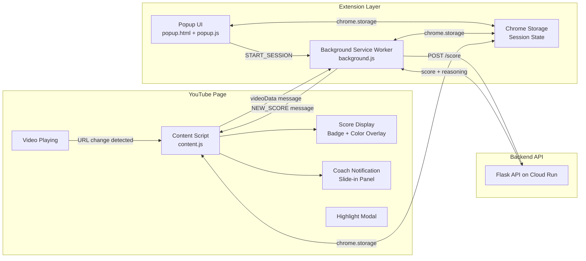
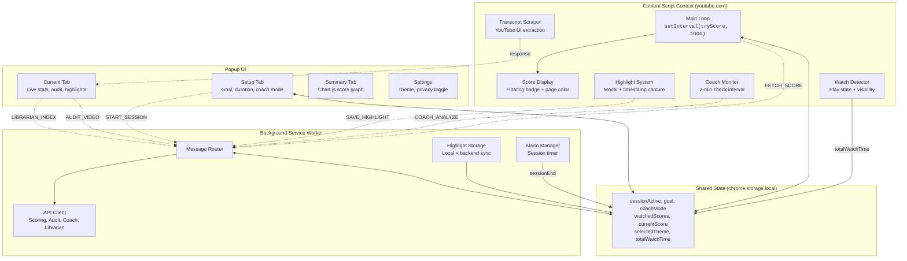
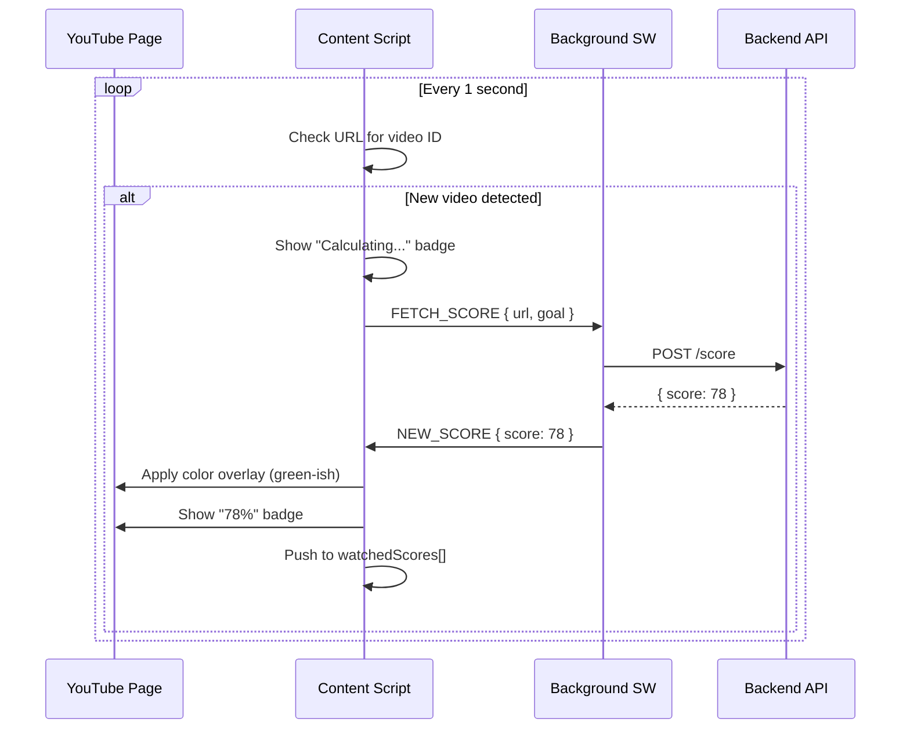
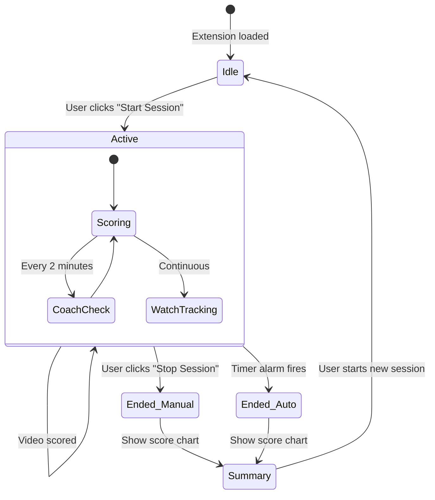
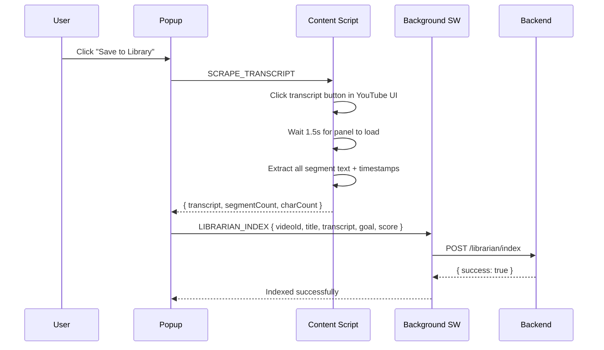
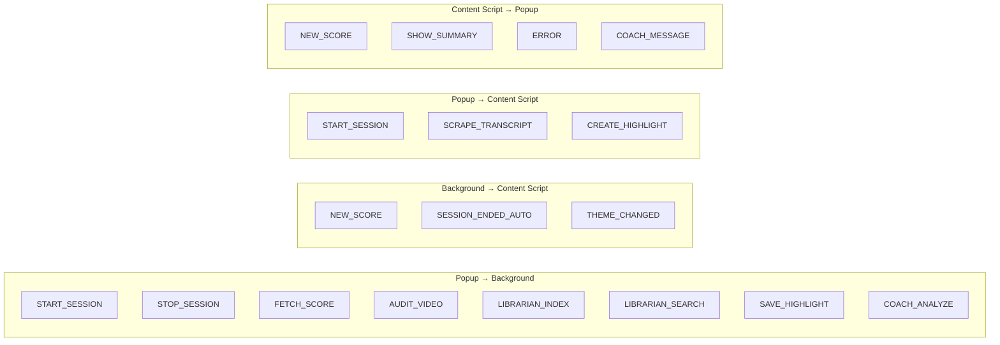

# TubeFocus Chrome Extension

Chrome Extension (Manifest V3) that scores YouTube videos against your learning goal in real time, provides AI-powered coaching during study sessions, and builds a searchable library of everything you watch.

## How It Works



## Architecture

The extension follows Chrome's Manifest V3 architecture with three isolated execution contexts communicating via message passing and shared storage.



## Features

### Real-Time Video Scoring

Every time you navigate to a new YouTube video during an active session, the content script:

1. Detects the video ID from the URL (polled every 1 second)
2. Sends a scoring request through the background service worker
3. Displays the relevance score (0-100%) as a floating badge
4. Applies a red-to-green color gradient across YouTube's UI containers



**Color mapping:**
- Score <= 30%: Red (`#dc2626`)
- Score >= 80%: Green (`#16a34a`)
- Between: Smooth RGB interpolation

### Session Management



**Session state** is stored in `chrome.storage.local` and synchronized across all three execution contexts:

| Key | Type | Description |
|-----|------|-------------|
| `sessionActive` | boolean | Whether a session is running |
| `goal` | string | User's learning goal |
| `sessionEndTime` | number | Unix timestamp for session end |
| `coachMode` | string | `strict`, `balanced`, `relaxed`, or `custom` |
| `watchedScores` | number[] | All scores from current session |
| `currentScore` | number | Score of the currently playing video |
| `totalWatchTime` | number | Seconds of active watching |
| `selectedTheme` | string | Current theme identifier |
| `showSummaryOnOpen` | boolean | Flag to auto-show summary tab |

### AI Coach

The content script runs a coach monitoring loop that checks behavioral patterns every 2 minutes:

1. Collects the last 15 video scores and metadata
2. Sends session data to `POST /coach/analyze`
3. Displays intervention notifications as slide-in panels on the YouTube page

**Coach modes** control intervention thresholds:

| Mode | Low Score Threshold | Max Distractions Before Alert |
|------|--------------------|-----------------------------|
| Strict | 50% | 1 |
| Balanced | 40% | 3 |
| Relaxed | 30% | 5 |
| Custom | 40% | 3 (+ user instructions) |

### Deep Analyze (Auditor)

The popup's "Deep Analyze" button triggers content verification:

1. Extracts video ID and title from the active tab
2. Sends to `POST /audit` via background service worker
3. Displays clickbait score, information density, and watch/skip/skim recommendation

### Video Library (Librarian)

"Save to Library" extracts the transcript directly from YouTube's native transcript panel (DOM scraping, not API) and indexes it for semantic search:



### Highlights

Users can save timestamped highlights with notes during video playback:

- **Via popup:** Click "Highlight Section" button
- **Via keyboard:** Press `H` while watching (not in a text input)
- Captures: current timestamp, video title, optional user note, and surrounding transcript text
- Stored locally in `chrome.storage` and synced to backend via Librarian

### Theme System

7 color schemes applied via CSS custom properties (`--bg`, `--panel`, `--text`, `--accent`, `--border`, `--highlight`):

| Theme | Background | Text |
|-------|-----------|------|
| Crimson Vanilla | `#c1121f` | `#fdf0d5` |
| Vanilla Crimson | `#fdf0d5` | `#c1121f` |
| Darkreader | `#181e22` | `#ddd` |
| Cocoa Lemon | `#774123` | `#f3e924` |
| Golden Ocean | `#1d352f` | `#efc142` |
| Dusty Apricot | `#418994` | `#fadfca` |
| Spiced Forest | `#263226` | `#f68238` |

Themes propagate to the YouTube page's score badge via `chrome.storage` listener in the content script.

## Message Protocol

All communication between contexts uses `chrome.runtime.sendMessage` and `chrome.tabs.sendMessage`.



## Project Structure

```
extension/
├── manifest.json           # Chrome extension manifest (V3)
├── popup.html              # Popup UI markup
├── popup.js                # Popup logic (tabs, stats, search, audit)
├── content.js              # YouTube page integration
│                             - Score display and color overlay
│                             - Transcript scraper (DOM-based)
│                             - Coach monitoring loop
│                             - Watch time detection
│                             - Highlight system
├── background.js           # Service worker
│                             - API communication proxy
│                             - Session alarm management
│                             - Message routing
│                             - Highlight local storage
├── config.js               # API URL, feature flags
├── styles.css              # Theme system + all UI styles
├── libs/
│   └── chart.min.js        # Chart.js for score visualization
├── dashboard/
│   └── app.js              # Focus Hub dashboard (highlights + RAG chat)
├── icons/
│   ├── icon16.png
│   ├── icon48.png
│   └── icon128.png
├── Settings.svg            # Settings gear icon
└── changelogs/             # Change history
```

## Setup

### Prerequisites

- Chrome browser (version 88+ for Manifest V3 support)
- TubeFocus backend API running (local or Cloud Run)

### Installation

1. Clone the repository
2. Open `chrome://extensions` in Chrome
3. Enable "Developer mode" (top-right toggle)
4. Click "Load unpacked"
5. Select the `extension/` directory

### Configuration

Edit `config.js` to point to your backend:

```javascript
const CONFIG = {
  API_BASE_URL: 'https://your-cloud-run-url',
  API_KEY: 'your-api-key',
  SCORE_UPDATE_INTERVAL: 1000,
  DEBUG_MODE: false
};
```

Alternatively, `background.js` has its own `CONFIG` object that takes precedence for API calls. Ensure both match your deployment.

### Permissions

The extension requests these Chrome permissions:

| Permission | Purpose |
|------------|---------|
| `storage` | Persist session state, scores, and highlights |
| `tabs` | Read active tab URL for video detection |
| `alarms` | Session timer countdown |
| `notifications` | Coach intervention alerts |
| `scripting` | Dynamic content script injection |

**Host permissions:** `youtube.com` (content script injection) and the Cloud Run API URL.

## Tech Stack

| Component | Technology |
|-----------|-----------|
| Platform | Chrome Extension Manifest V3 |
| Language | Vanilla JavaScript (ES6+) |
| Styling | CSS3 with custom properties (theming) |
| Charts | Chart.js |
| Storage | chrome.storage.local |
| Communication | chrome.runtime message passing |
